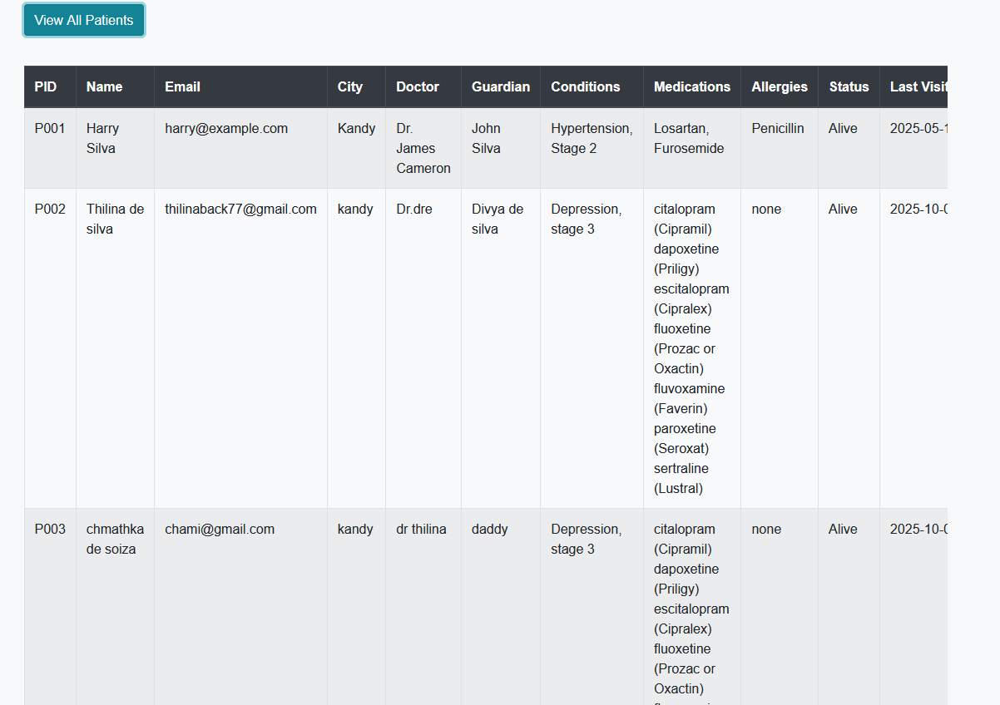

# 🏥 Patient Record Management System

A full-stack web application designed to digitize patient health records for medical clinics. This system replaces manual file keeping with a secure, searchable, and efficient digital database.

## 🚀 Key Features
* **Patient Registration:** Digital intake forms for new patients (Personal details, Medical history, Allergies).
* **Real-time Dashboard:** View all patient records in a dynamic table view.
* **Advanced Search:** Instantly find patients by ID, Name, City, or Doctor.
* **Data Persistence:** All records are securely stored in a cloud-based **MongoDB Atlas** database.

## 🛠️ Tech Stack
* **Frontend:** HTML5, CSS3, JavaScript (jQuery), Bootstrap 4
* **Backend:** Node.js, Express.js
* **Database:** MongoDB (Atlas Cloud)
* **Architecture:** RESTful API

## 📸 Screenshots
### Patient Dashboard & Search


### Patient Intake Form


## 💻 How to Run Locally
1.  Clone the repository.
2.  Install Backend Dependencies:
    ```bash
    cd backend
    npm install
    ```
3.  Configure Database:
    * Update `server.js` with your MongoDB Connection String.
4.  Run the Server:
    ```bash
    node server.js
    ```
5.  Open `frontend/index.html` in your browser.
